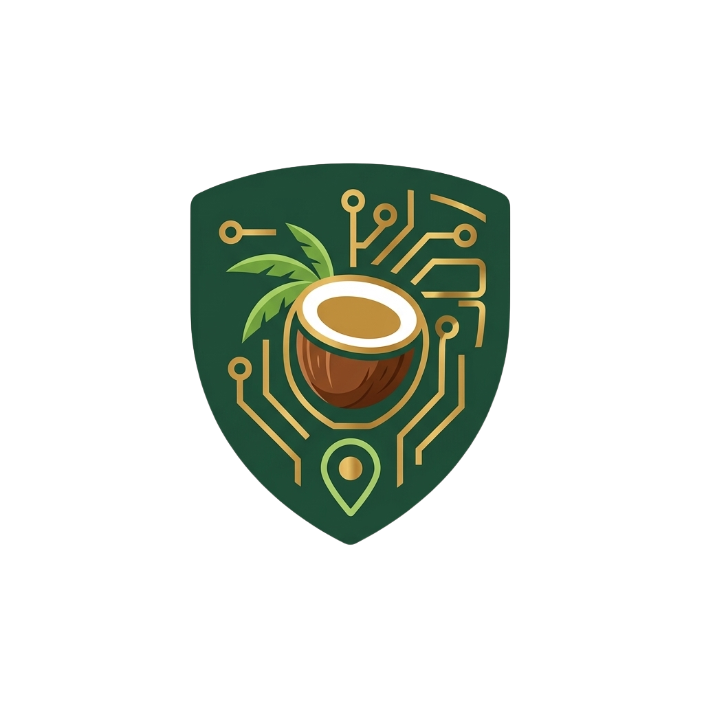

<div align="center">



# Cocopra.id

### 🌴 AI-Powered Agritech Platform for Coconut Farmers

[](https://vuejs.org/)
[](https://vitejs.dev/)
[](https://tailwindcss.com/)
[](LICENSE)

**PROXOCORIS International Competition 2026 — Web Development Category**

_Team Trio Nyawit UVICS — Universitas Klabat, Sulawesi Utara_

[🌐 Live Demo](#) · [📹 Video Demo](#) · [📄 Proposal](#)

</div>

---

## 📋 Table of Contents

- [About](#-about)
- [Theme & Relevance](#-theme--relevance)
- [Features](#-features)
- [Tech Stack](#-tech-stack)
- [Project Structure](#-project-structure)
- [Getting Started](#-getting-started)
- [Team](#-team)

---

## 🌿 About

**Cocopra.id** is an integrated AI-powered agritech web platform designed to improve the welfare of coconut farmers in North Sulawesi, Indonesia. The platform addresses three critical challenges faced by coconut farmers:

- 🐛 **Undetected pests** — Rhinoceros Beetle attacks often go unnoticed until permanent damage occurs
- 💰 **Opaque copra pricing** — Long supply chains and lack of local price data weaken farmers' bargaining power
- 📋 **Regulatory barriers** — Difficulty accessing official pesticide guidelines from the government

Cocopra.id bridges these gaps through AI-driven pest detection, real-time price transparency, and smart early warning systems.

---

## 🎯 Theme & Relevance

**Competition Theme:** _"Bridging Gaps: Code for Earth, Intelligence for Justice, and Sustainability for Shaping Tomorrow"_

**Subtema:** AI for Climate Justice and Social Resilience & Green Technology for All

Cocopra.id directly addresses this theme by:

- Using **AI ethically** for pest detection to reduce pesticide overuse
- Promoting **price transparency** and economic justice for smallholder farmers
- Providing **offline-first PWA** capabilities for areas with limited connectivity
- Supporting **sustainable agriculture** through evidence-based recommendations

---

## ✨ Features

| Feature                    | Description                                                                | Status |
| -------------------------- | -------------------------------------------------------------------------- | ------ |
| 🔍 **Pest-Vision Scanner** | AI-powered pest detection using CNN (98.4% accuracy) via Gemini Vision API | ✅     |
| 💹 **Adil-Harga Ledger**   | Real-time copra price monitoring from local to global markets              | ✅     |
| 🗺️ **Geo-Alert EWS**       | Interactive map for early warning of pest spread by GPS location           | ✅     |
| 🤖 **RAG Agri-Assistant**  | LLM chatbot grounded in official Ministry of Agriculture documents         | ✅     |
| ✅ **Regulatory Check**    | Instant pesticide legality verification from official database             | ✅     |
| 📊 **Dashboard Petani**    | Personalized dashboard for farmers with activity feed & price widget       | ✅     |
| 🔐 **Auth System**         | Secure login/register with role-based access (Farmer / Agriculture Agency) | ✅     |
| 🌐 **Bilingual EN/ID**     | Full English & Indonesian language support via vue-i18n                    | ✅     |
| 📱 **Responsive Design**   | Optimized for Desktop, Tablet, and Mobile                                  | ✅     |
| 🔌 **Offline-First PWA**   | Works without internet, syncs when connection is available                 | 🚧     |

---

## 🛠️ Tech Stack

### Frontend

| Technology             | Version | Purpose                      |
| ---------------------- | ------- | ---------------------------- |
| Vue.js                 | 3.x     | Core framework               |
| Vite                   | 5.x     | Build tool & dev server      |
| Tailwind CSS           | 3.x     | Utility-first styling        |
| Vue Router             | 4.x     | Client-side routing          |
| Vue i18n               | 9.x     | Internationalization (EN/ID) |
| Lucide Vue             | Latest  | Icon library                 |
| Chart.js + vue-chartjs | 4.x     | Data visualization           |
| AOS                    | Latest  | Scroll animations            |
| Leaflet                | Latest  | Interactive maps             |

### Backend _(In Development)_

| Technology        | Purpose                        |
| ----------------- | ------------------------------ |
| Node.js + Express | REST API server                |
| JWT               | Authentication & authorization |
| PostgreSQL        | Primary database               |

### AI & APIs _(In Development)_

| API                      | Purpose                    |
| ------------------------ | -------------------------- |
| Google Gemini Vision API | Pest detection from images |
| RAG Pipeline             | Agricultural document Q&A  |

---

## 📁 Project Structure

```
PROXO-main/
├── public/
│   ├── Logo-Cocopra.id.png
│   ├── favicon.svg
│   └── michael-oxendine-aKvfQV4WpiA-unsplash.jpg
├── src/
│   ├── components/
│   │   ├── dashboard/
│   │   │   ├── ActivityFeed.vue
│   │   │   ├── DashboardHeader.vue
│   │   │   ├── DashboardSidebar.vue
│   │   │   ├── KopraPriceWidget.vue
│   │   │   └── StatsCard.vue
│   │   ├── AppFooter.vue
│   │   ├── AppNavbar.vue
│   │   ├── AuthModal.vue
│   │   └── VideoModal.vue
│   ├── i18n/
│   │   ├── index.js
│   │   ├── id.js          # Indonesian translations
│   │   └── en.js          # English translations
│   ├── router/
│   │   └── index.js
│   ├── views/
│   │   ├── dashboard/
│   │   │   └── DashboardView.vue
│   │   ├── HomeView.vue
│   │   ├── NotFound.vue
│   │   ├── ServerError.vue
│   │   ├── Maintenance.vue
│   │   └── Forbidden.vue
│   ├── App.vue
│   ├── main.js
│   └── style.css
├── index.html
├── package.json
├── tailwind.config.js
├── vite.config.js
└── README.md
```

---

## 🚀 Getting Started

### Prerequisites

- Node.js >= 18.x
- npm >= 9.x

### Installation

```bash
# 1. Clone the repository
git clone https://github.com/DaxnGo/PROXO.git

# 2. Navigate to project directory
cd PROXO

# 3. Install dependencies
npm install

# 4. Start development server
npm run dev
```

### Build for Production

```bash
npm run build
```

Open [http://localhost:5173](http://localhost:5173) in your browser.

---

## 👥 Team

**Team Name:** Trio Nyawit UVICS

**Institution:** Universitas Klabat, Sulawesi Utara, Indonesia

| Role                  | Name               |
| --------------------- | ------------------ |
| 🎨 UI/UX Designer     | Matthew Pangemanan |
| 💻 Frontend Developer | Jeremiah Lengkong  |
| ⚙️ Backend Developer  | Jofan Kalengkongan |

---

## 📄 License

This project is developed for **PROXOCORIS International Competition 2026**.  
© 2026 Trio Nyawit UVICS — Universitas Klabat.

---

<div align="center">

**🌴 Cocopra.id — Protecting Coconut Farms with Artificial Intelligence**

_Built with ❤️ from North Sulawesi, Indonesia_

</div>
