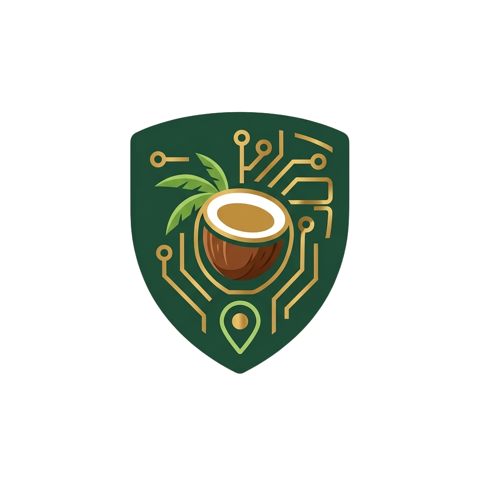

<div align="center">



# Cocopra.id

### 🌴 AI-Powered Agritech Platform for Coconut Farmers

[](https://vuejs.org/)
[](https://fastapi.tiangolo.com/)
[](https://vitejs.dev/)
[](https://tailwindcss.com/)
[](LICENSE)

**PROXOCORIS International Competition 2026 — Web Development Category**

_Team Trio Nyawit UVICS — Universitas Klabat, Sulawesi Utara_

[🌐 Live Demo](#) · [📹 Video Demo](#) · [📄 Proposal](#)

</div>

---

## 🌿 About

**Cocopra.id** is an integrated AI-powered agritech web platform designed to improve the welfare of coconut farmers in North Sulawesi, Indonesia. The platform addresses three critical challenges:

- 🐛 **Undetected pests** — Rhinoceros Beetle attacks often go unnoticed until permanent damage occurs
- 💰 **Opaque copra pricing** — Long supply chains and lack of local price data weaken farmers' bargaining power
- 📋 **Regulatory barriers** — Difficulty accessing official pesticide guidelines from the government

---

## 🎯 Theme & Relevance

**Competition Theme:** _"Bridging Gaps: Code for Earth, Intelligence for Justice, and Sustainability for Shaping Tomorrow"_

**Subtema:** AI for Climate Justice and Social Resilience & Green Technology for All

---

## ✨ Features

| Feature | Description | Status |
|---|---|---|
| 🔍 **Pest-Vision Scanner** | AI-powered pest detection using CNN (98.4% accuracy) via Gemini Vision API | ✅ |
| 💹 **Adil-Harga Ledger** | Real-time copra price monitoring from local to global markets | ✅ |
| 🗺️ **Geo-Alert EWS** | Interactive map for early warning of pest spread by GPS location | ✅ |
| 🤖 **RAG Agri-Assistant** | LLM chatbot grounded in official Ministry of Agriculture documents | ✅ |
| ✅ **Regulatory Check** | Instant pesticide legality verification from official database | ✅ |
| 📊 **Dashboard Petani** | Personalized dashboard for farmers with activity feed & price widget | ✅ |
| 🔐 **Auth System** | Secure login/register with role-based access (Farmer / Agriculture Agency) | ✅ |
| 🌐 **Bilingual EN/ID** | Full English & Indonesian language support via vue-i18n | ✅ |
| 📱 **Responsive Design** | Optimized for Desktop, Tablet, and Mobile | ✅ |
| 🔌 **Offline-First PWA** | Works without internet, syncs when connection is available | 🚧 |

---

## 🛠️ Tech Stack

### Frontend

| Technology | Version | Purpose |
|---|---|---|
| Vue.js | 3.x | Core framework |
| Vite | 8.x | Build tool & dev server |
| Tailwind CSS | 3.x | Utility-first styling |
| Vue Router | 5.x | Client-side routing |
| Vue i18n | 9.x | Internationalization (EN/ID) |
| Lucide Vue | Latest | Icon library |
| Chart.js + vue-chartjs | 4.x | Data visualization |
| Leaflet | Latest | Interactive maps |
| AOS | Latest | Scroll animations |

### Backend

| Technology | Purpose |
|---|---|
| Python + FastAPI | REST API server |
| SQLite | Local database |
| ChromaDB | Vector store for RAG |
| Google Gemini API | AI pest detection & assistant |

---

## 📁 Project Structure

```
Cocopra.id/
├── PROXO/                    # 🖥️ Frontend (Vue.js + Vite + Tailwind)
│   ├── public/               #    Static assets & logo
│   ├── src/
│   │   ├── components/       #    Reusable Vue components
│   │   │   └── dashboard/    #    Dashboard-specific components
│   │   ├── views/            #    Page views
│   │   │   └── dashboard/    #    Dashboard views
│   │   ├── api/              #    Axios API client
│   │   ├── i18n/             #    EN/ID translations
│   │   ├── router/           #    Vue Router config
│   │   ├── stores/           #    Pinia stores
│   │   ├── assets/           #    Images & SVGs
│   │   ├── App.vue           #    Root component
│   │   └── main.js           #    App entry point
│   ├── package.json
│   ├── tailwind.config.js
│   └── vite.config.js
│
├── backend/                  # ⚙️ Backend (Python + FastAPI)
│   ├── routers/              #    API route handlers
│   │   ├── assistant.py      #    RAG AI assistant
│   │   ├── auth.py           #    Authentication
│   │   ├── geo.py            #    Geo-Alert EWS
│   │   ├── harga.py          #    Copra price API
│   │   ├── pest.py           #    Pest scanner API
│   │   └── regulatory.py     #    Regulatory check
│   ├── data/                 #    Reference data files
│   ├── scripts/              #    Utility scripts
│   ├── main.py               #    FastAPI app entry
│   ├── models.py             #    Database models
│   ├── schemas.py            #    Pydantic schemas
│   ├── database.py           #    DB connection
│   ├── rag_engine.py         #    RAG pipeline
│   └── requirements.txt      #    Python dependencies
│
├── frontend/                 # 📦 Legacy React frontend (reference)
│
├── run_all.bat               # ▶️  Start both servers
├── run_backend.bat           # ▶️  Start backend only
├── run_frontend.bat          # ▶️  Start frontend only
├── .gitignore
└── README.md                 # 📄 This file
```

---

## 🚀 Getting Started

### Prerequisites

- **Node.js** >= 18.x & **npm** >= 9.x
- **Python** >= 3.10

### Quick Start

```bash
# 1. Clone the repository
git clone https://github.com/DaxnGo/Cocopra.id.git
cd Cocopra.id

# 2. Start both servers (Windows)
run_all.bat
```

### Manual Setup

**Frontend:**

```bash
cd PROXO
npm install
npm run dev
# Opens at http://localhost:5173
```

**Backend:**

```bash
cd backend
pip install -r requirements.txt
uvicorn main:app --reload --host 0.0.0.0 --port 8000
# API at http://localhost:8000/docs
```

---

## 👥 Team

**Team Name:** Trio Nyawit UVICS

**Institution:** Universitas Klabat, Sulawesi Utara, Indonesia

| Role | Name |
|---|---|
| 🎨 UI/UX Designer | Matthew Pangemanan |
| 💻 Frontend Developer | Jeremiah Lengkong |
| ⚙️ Backend Developer | Jofan Kalengkongan |

---

## 📄 License

This project is developed for **PROXOCORIS International Competition 2026**.
© 2026 Trio Nyawit UVICS — Universitas Klabat.

---

<div align="center">

**🌴 Cocopra.id — Protecting Coconut Farms with Artificial Intelligence**

_Built with ❤️ from North Sulawesi, Indonesia_

</div>
